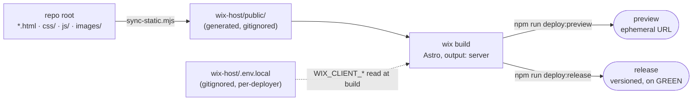
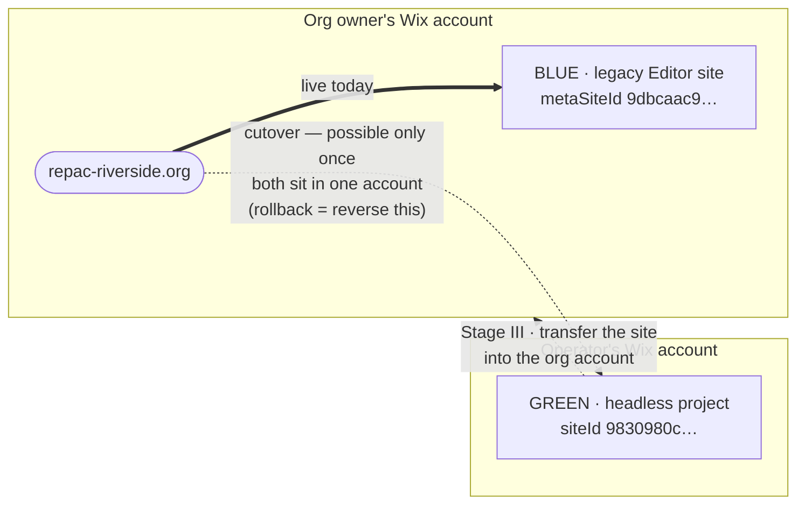

# REPAC Deployment — Wix-Managed Headless

Canonical reference for deploying the REPAC static site. **The human is the executor:** preview and
release are local commands run by an account owner. There is no CI that talks to Wix (§2).

## 1. Architecture

The site is plain static HTML (`*.html`, `css/`, `js/`, `images/` at the repo root). Wix-Managed
Headless requires an Astro frontend, so `wix-host/` is a thin Astro wrapper:



- `scripts/sync-static.mjs` copies the root static files into `wix-host/public/` (generated, gitignored).
- Wix serves `public/` at the site root. `/` serves `public/index.html`, sub-pages and assets return
  200, unknown paths 404 — all with an empty `src/pages/` (only `404.astro`). No `index.astro` needed.
- `astro.config.mjs`: `output: 'server'`, integrations `[wix()]`, adapter
  `@wix/cloud-provider-fetch-adapter` (applied only when `NODE_ENV=production`). The adapter picks its
  backend from `WIX_CLOUD_PROVIDER`; when that var is absent the build falls back to
  `@astrojs/cloudflare`, so **that package must stay a dependency**.

Project linkage lives in `wix-host/wix.config.json` (committed — identifiers, not secrets):
`appId 00bcd193-1c95-4f01-a2bd-b47bf917fb52`, `siteId 9830980c-d83c-48fd-aa0c-d67c909406bd`.

## 2. Why there is no CI

Wix's privileged CLI operations require an **account-owner session that an API key cannot hold**.
`wix env pull` fails in CI with `403 PERMISSION_DENIED: VELO.APP_PROJECT_READ`, tested with a key
broadened to all sites (premium + drafts) — still failed. `VELO.APP_PROJECT_READ` is an app/project-owner
permission on a different axis from site access; it is not grantable to an API key at any scope.

So the owner runs the privileged steps locally, where an owner session already exists (§3). CI does
nothing Wix-related; the owner's local `wix build` is the build check.

**What CI does do (`.github/workflows/checks.yml`).** One check, nothing Wix-related — it never
authenticates, never builds, and cannot deploy. `node scripts/check-links.mjs` walks the root
`*.html` for `href`/`src` targets and fails with `file:line` if the target file is missing. This is
the repo's observed bug class: #15 and #24 were both dead references left behind by a renamed or
deleted page. External URLs are fetched too: a **404/410 fails the build**; timeouts, 403 bot-blocks
and 5xx print as warnings so a flaky third party can't block an unrelated PR. `SKIP_EXTERNAL=1`
skips the network. No dependencies, no `npm install` — the script uses only `node:` builtins.

**[VERIFIED] A `wix build` *is* possible in CI, and we still don't do one.** Tested in a clean
environment (no `~/.wix/auth`, no `.env.local`): the build fails at `astro:config:setup` with
`Missing environment variable WIX_CLIENT_ID`, but supplying **only** `WIX_CLIENT_ID` (a public OAuth
identifier, not a secret — `WIX_CLIENT_SECRET` is not needed to build) produces a complete `dist/`
in ~2s. So the wall above guards `env pull`/`preview`/`release`, **not** `build`. Omitted anyway:
content PRs can't break the Astro build, and the owner builds locally before every deploy. Recorded
so the feasibility question isn't re-tested from scratch.

Abandoned approaches, recorded so they aren't reopened:
- CI `wix login --api-key` + `wix env pull` — dies at the 403 above.
- Env-injection (`WIX_CLIENT_*` as GitHub secrets, skip `env pull`) — `wix preview` is itself an
  app-project operation and would likely 403 on the same wall; not worth carrying the client secret
  in GitHub to find out.
- Keyless static-check CI — only re-ran the file copy the local build already does. Deleted.

## 3. Authentication

- **`wix login`** (browser) writes an OAuth session to `~/.wix/auth` (~4h + refresh token). This
  owner session is what clears the §2 wall, so it is what authorizes preview and release.
- **`wix whoami`** fronts both deploy scripts as a fail-fast check — a dead session aborts in ~4s,
  before the build. If a script stops there, re-run `npx wix login`.
- **`.env.local`** (`WIX_CLIENT_ID` / `_SECRET` / `_PUBLIC_KEY` / `_INSTANCE_ID` / `WIX_CLOUD_PROVIDER`)
  is the headless OAuth app's identity, read by the build. It is gitignored, so it **does not travel
  with git**: every checkout and every deployer needs their own via
  [`wix env pull`](https://dev.wix.com/docs/wix-cli/command-reference/project-commands/env-pull) while
  logged in. A checkout without one fails the build with `WIX_CLIENT_ID not found`. For secrets a
  collaborator can't pull, see
  [Share Environment Variables](https://dev.wix.com/docs/go-headless/wix-managed-headless/project-development/environment-variables/share-environment-variables).
- **No CI credentials.** The old `WIX_API_KEY` secret and `WIX_CLIENT_ID` repo variable were deleted
  as unused — an API key cannot clear the §2 wall.

## 4. Preview and release

```bash
cd wix-host
npm run deploy:preview   # whoami -> build -> wix preview   (ephemeral URL; safe)
npm run deploy:release   # whoami -> build -> wix release   (deliberate, owner-run)
```

Owner go-ahead for release was granted Aug 2026. There is no `wix rollback` command, and a release
does **not** reassign the live domain — that is the separate cutover in §5. Two useful properties from
Wix's [Build and Deploy a Headless Project](https://dev.wix.com/docs/go-headless/wix-managed-headless/full-integration-astro/development/build-and-deploy-with-the-cli):
each preview URL is pinned to its own version and later pushes don't alter it, and `wix release`
clears the whole site cache — if stale content survives a deploy, release again.

Validate a preview before any release or cutover — open the ephemeral URL and confirm `/` renders the
real homepage (not the 404 route), that the UNOFFICIAL DRAFT banner is absent, and that a bogus path
serves the 404 page. Quick automated pass:

```bash
BASE="https://<preview-host>.wix-site-host.com"   # from the deploy:preview output
for p in / about.html engineering-program.html events.html repac-faq.html css/style.css js/main.js; do
  printf '%s %s\n' "$(curl -s -o /dev/null -w '%{http_code}' "$BASE/$p")" "$p"
done            # expect 200 for every line
```

## 5. Cutover and rollback — deferred

The live site and the headless project are two separate Wix properties — **BLUE** is what serves
traffic today, **GREEN** is the replacement being proven. **Identify them by ID, never by console
display name** (names are editable and easy to confuse):

| | Property | Fixed ID | Role |
|---|---|---|---|
| **BLUE** | Legacy Wix Editor site | metaSiteId `9dbcaac9-3336-4ec2-8c8f-4a4f275aad06` | Live now; **keep** = rollback target |
| **GREEN** | Headless project | siteId `9830980c-d83c-48fd-aa0c-d67c909406bd` | Deploy target (= `wix.config.json`) |

Domain reassignment is a **within-account** operation, and today the two properties live in different
accounts — that, not permissions, is what blocks cutover:



Confirm BLUE from the live domain itself:
`curl -s https://www.repac-riverside.org/ | grep -o '"metaSiteId":"[^"]*"' | head -1` → `9dbcaac9-…`.
Any site that is neither of these is unrelated — do not touch it.

Wix cannot convert an Editor site to headless in place or migrate its data, so go-live is a
**cross-property domain move**, not an upgrade. An owner dashboard audit (Aug 2026) found no business
data on BLUE to preserve — zero Contacts, zero Site Members beyond account-level admin logins, and
commerce is an external Square store. The recovery point is simply the intact legacy site.

**BLUE also hosts live assets — a second, independent reason not to delete it.** Two PDFs the site
links to are served from `9dbcaac9-….filesusr.com/ugd/…`, and that host *is* BLUE's metaSiteId: they
live in the legacy site's Media Manager. Deleting BLUE breaks them even after a successful cutover —
exactly when the rollback-lever argument stops feeling urgent. Retiring BLUE is **not** a no-op
cleanup task; move the PDFs first.

**Document-hosting policy.** Organizational documents the site links to — bylaws, minutes, forms,
handbooks, decks — live in the **REPAC Google account's Drive**, not in this repo and not in either
Wix property's Media Manager. Officers can update them without a deploy, they survive BLUE's
retirement and any future platform move, and ownership follows the org's account rather than an
individual's or a vendor's. Each linked file must be *Anyone with the link → Viewer* and owned by the
REPAC account, or it 404s for the public. Small assets that are part of the page itself (logos,
badges, photos) stay in `images/` — the policy covers documents, not page furniture. The two
`filesusr.com` PDFs predate this policy and still need moving.

**Rollback layers, strongest lever last:**
1. Only release an artifact already validated via its preview URL (§4).
2. `git revert <bad-commit>` → re-release. Deterministic, repo is source of truth. Primary rollback.
3. Re-promote an earlier release from the dashboard — Wix documents versioned releases for *apps*,
   not for headless projects, so treat this as unavailable and rely on 2.
4. Reassign the domain back to BLUE. A domain maps to one property at a time; both can be Premium at
   once. This is a within-Wix reassignment with an SSL re-validation window, not a DNS TTL flip.

### Prerequisites

- **[BLOCKER] Consolidate BLUE, the domain, and GREEN into the org owner's account.** Wix scopes
  reassignment to the account: *"Assign any domain **in your Wix account** to your site"*
  ([Assigning a Domain to a Site](https://support.wix.com/en/article/assigning-a-domain-to-a-site-in-your-wix-account)).
  Today the domain and BLUE are in the org owner's account and GREEN is in the operator's, so the swap
  cannot be done as-is. Direction: bring **GREEN to the org**
  ([Transferring a Premium Site to Another Wix Account](https://support.wix.com/en/article/transferring-a-premium-site-to-another-wix-account)),
  not BLUE to the operator — the org keeps ownership of its web presence. The transfer form has
  separate opt-in checkboxes for the site plan and the domain, the recipient needs an existing Wix
  account, and **the invite expires in 3 days**
  ([Accepting Transferred Site Ownership](https://support.wix.com/en/article/accepting-transferred-site-ownership)),
  so coordinate it live rather than emailing and waiting. The metaSite id is stable across account
  moves, so the repo keeps deploying to the same GREEN.
- **[VERIFY] Does co-owner/admin suffice for `release`/`preview`?** Wix documents that a collaborator
  added to the project can `wix env pull` and "build, preview, and release it with the Wix CLI, just
  like you can" ([Invite Collaborators](https://dev.wix.com/docs/go-headless/project-management/invite-collaborators)) —
  so this is expected to work. Our 403 (§2) was an API key, not a human collaborator. Stage II
  confirms it in this account before anything is handed over.
- **Premium plan on GREEN, bought in the org account** (after the transfer) — Wix-Managed Headless needs
  one to serve a custom domain, and Premium is per-site.

### Execution — three stages

Prove GREEN under progressively less privilege, then hand the domain switch to the org.

- **Stage I — deploy to GREEN as OWNER. ✅ DONE (Aug 2026).** While the operator still owns GREEN:
  merge the banner removal to `main`, then `deploy:preview` → validate (§4) → `deploy:release`.
  *Exit:* a validated, released GREEN. No org involvement. Results and gotchas below.
  **Stage I results.** GREEN is released and serving at
  `https://riverside-7e51510a-drewshapiro.wix-site-host.com`. All 11 pages, `css/style.css`,
  `js/main.js` and images return 200; an unknown path returns 404; `/` serves the real homepage, not
  the 404 route; the draft banner is absent; the board roster is present and no `class="placeholder"`
  block is served. The live domain still resolves to BLUE (`metaSiteId 9dbcaac9-…`) — a release does
  not touch the domain.

  Two things to know before validating a future deploy:
  - **The first request to `/` after a deploy returns 500.** Seen on both the preview and the release,
    then 10+ consecutive 200s with no intervention — a cold start of the server bundle, not a broken
    build. Hit it twice before concluding anything is wrong. Sub-pages did not show it.
  - **The banner removal is merged to `main` now**, so previews no longer need a special branch. The
    earlier "preview from whatever branch has the banner removed" advice is spent: `main` is the
    deploy source. What now keeps an unreviewed draft off the public domain is that the domain still
    points at BLUE, not the banner.

- **Stage II — deploy to GREEN as ADMIN (co-owner). ✅ DONE (Aug 2026).** Ran the colleague-sandbox
  round-trip: GREEN transferred to a trusted colleague, operator re-invited as co-owner, then
  `wix env pull`, `deploy:preview` and `deploy:release` **all succeeded from the co-owner role**.

  **This settles "who deploys."** A co-owner needs no ownership: `env pull` is the command that 403s
  for an API key (§2), and it works for a human collaborator. So the §2 wall is about *API keys*, not
  about *ownership* — the distinction the whole handoff model rests on. Release works too, not just
  preview, so the org does not have to route deploys through whoever happens to hold the account.

  Not captured during the test, and worth noting next time: whether the pulled `.env.local` matched
  the pre-transfer copy, the new preview/release host (the `…-drewshapiro…` segment encodes the owner
  account and should change under another), and whether the cold-start 500 recurred.
- **Stage III — transfer GREEN into the org's account for the domain switch.** Only after I and II
  pass. Then the org's officers reassign the domain BLUE→GREEN at their discretion — a subdomain
  (`beta.repac-riverside.org`) first, then the apex — with rollback = reassign back to BLUE.
  **Keep the legacy Editor site published and undeleted.** *Exit:* cutover owned by the org.

## 6. Ownership transfer / client handoff

Deploy auth is a local owner `wix login` session, not a stored key, so handoff is: the new owner logs
in as themselves, runs `wix env pull` for their own `.env.local` (§3), and runs the `deploy:*` scripts.
There is no CI secret to rotate. They need owner or co-owner rights on the headless project —
**co-owner is [VERIFIED] sufficient for `env pull`, `preview` and `release`** (Stage II, §5). Note the
preview URL host encodes the owner account (`…-drewshapiro.wix-site-host.com`) and will change under
theirs.

## 7. Quick reference

```bash
cd wix-host
npm install
npx wix login            # one-time owner login (browser; session ~4h)
npx wix env pull         # one-time per checkout/deployer: writes the gitignored .env.local
npm run deploy:preview
npm run deploy:release
```

CLI is `@wix/cli` (GA Feb 2026). Commands used: `login`, `whoami`, `env pull`, `build`, `preview`,
`release`. No `rollback`.
